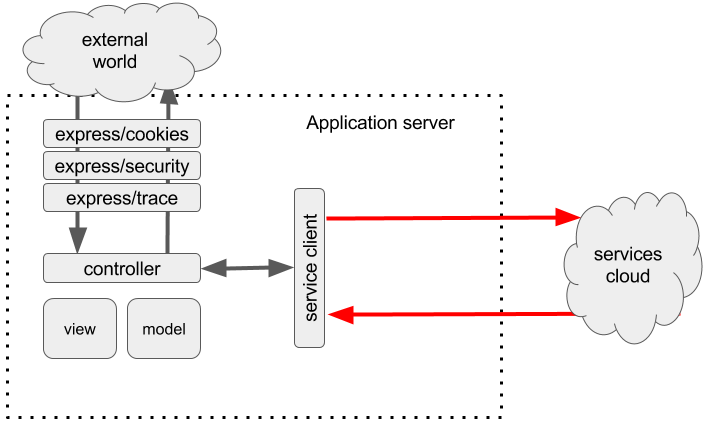
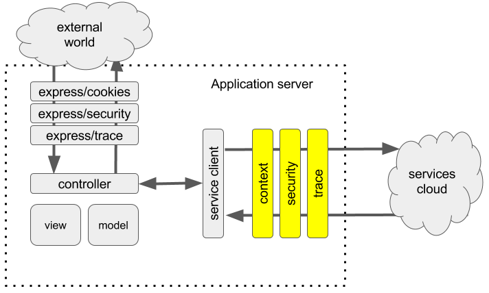

# The Ideal Framework

In this series we are going to explain the reasons behind architecture of eBay open-source pipeline framework called Trooba.

## Why do we need a framework?

One of the goals while building enterprise platform is to minimize the energy spent on maintaining a platform while supporting growing number of applications and teams that use it. This is usually accomplished with the use of various frameworks.

The framework defines guidelines on how things should be done; which allows to maintain the same structure of the system and keeps it recognizable to other developers and reduces maintenance costs.

By taking the execution of repetitive tasks on itself it minimizes the amount of code that needs to written by an application developer and thus reducing the number of bugs.

The framework needs to be simple enough to guarantee a quick on-boarding of new developers and teams, provide tools for fast debugging and troubleshooting. It is better be based on open standards and allow to form a developer community around to set it on self-sustainable path via contributions.

There are already many frameworks out there that organize how things should be done in Node.JS. Marko, React or Angular define guidelines how UI should be done. The frontend and backend service guidelines are defined by Express, Hapi, Kraken-js. Microservice infrastructure can be built using Hemera or Senecajs.

One of the important areas for the platform team is to provide ways to manage data flows.

## What it takes to make an http service call?

* Create an HTTP client
* Initiate a call
* Wait for response
* Handle edge cases and return data to the caller

Here’s high level diagram:

## Will this scale?

What if you need to …

* Provide secure token in the header
* A/B testing
* Analytics
* Validate client before making a call
* Generate trace events to central logging repository
* Upgrade service client code in all 1000+ application

Should we ask every application developer to do this job?

The answer is obvious - framework should do this automatically and transparently to the user.

## What is available?

* http and https core modules that are not generic, low level, bound to http protocol and still require a lot of work from a developer.
* request is http module, very popular still requires a lot of work from a developer.
* wreak from hapi team (http protocol) focuses on http protocol, still low level.
* axios is a next level comparing to the earlier mentioned modules, provides a pipeline support via hooks, isomorphic but still http bound.
* Seneca.js is very good microservice framework, limited to nodejs environment and hard to build pipelines.
* Hemera is similar to seneca and goes higher with abstracting transport into NATS framework supported by multiple languages, almost perfect, but still hard to build pipelines.
* gRPC is low latency, streaming support, multiplexing channels, protocol oriented, still no way to build pipelines.

Some concerns listed among benefits should not be considered as a bad side of the framework being reviewed. Maybe this is how it should be, we do not want to have a huge framework that does all kinds of things possible as it goes agains modular approach. All of the above modules/frameworks represent a good deal of effort by the owners and community as a whole that should not be wasted. They all have very good parts that can be used by other modules to avoid re-inventing the wheel.

## What do we want our framework to be?

What we want is to have a framework that would allows us to easily connect or use the above mentioned frameworks and modules.

* Generic: should not dictate low level logic on how things should be done
* Isomorphic: used in browser and at server side
* Minimalistic: simple and familiar interface, allow superagent API or gRPC proto API, for example
* Modular: allow more complex compositions out of basic elements
* Protocol and transport free where transport is replaceable without application code change
* Customizable: a developer can add its own instruments/hooks
* Support existing and new use-cases (see below)
* Able to use good parts provided by above frameworks
* Be an extension to other frameworks, not always a replacement

## What use-cases do we want to support?

* Pub/Sub
* Request/Response
* Request/Response stream
* Request stream/Response
* Request stream/Response stream

## Why not use a popular middleware pattern?

That’s the idea that will give us the same manageable structure to to make service calls as express did to the incoming http traffic.

In the next chapter we will continue exploring what we need to create a scalable pipeline framework for making service calls in Node.JS app.
