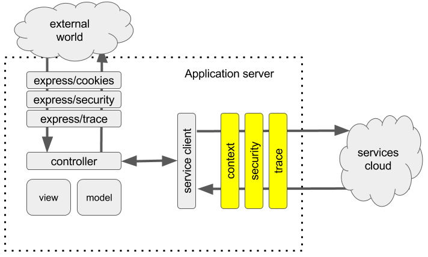

# Separation Of Concerns

In this chapter we are going to explore what makes a service pipeline framework more scalable and ways to achieve the goal by following the principle “Separation of Concern.”

Wiki tells us: “In computer science, separation of concerns (SoC) is a design principle for separating a computer program into distinct sections, such that each section addresses a separate concern.”

We decided to follow the same middleware pattern that worked pretty well for expressjs.

We would like to identify basic steps/handlers required to make a call in any enterprise application.

* Authentication/Authorization, usually service calls are protected by requiring secure tokens that should be acquired before making a call. They can carry genetic information about the application that makes a call or contain more specific details about the actual user involved into the flow.
* Validation, may be required to check if service scope (Oauth2) is allowed to make a service call.
* Analytics, one might want to provide analytics data to the downstream services and back to the client.
* Tracing is very important for troubleshooting and allows to aggregate all actions/calls occurred during a specific transaction.
* Context serialization/de-serialization are used to propagate contextual information across different service instances involved into a distributed transaction. This makes it look like a transaction running on one box.
* Error handling/formatting is good to abstract from specific protocol into more generic error codes and statuses.
* Retry logic can be used to react to timeouts or 503 (too busy signal) from the downstream service and is part of the platform resiliency.
* Circuit breaker allows to react to edge cases from downstream and upstream flows with fallback.
* Custom handlers/transports: the framework should allow to add custom hooks/handlers to the existing pipeline or build its own entirely.
* Transport is a bridge between a generic pipeline and specific protocol like REST or gRPC.
* Metrics collection is useful when one want to be aware of what has happened with the pipeline in the past.
* Rate limiter allows to limit the number of request that can go through the pipeline at any moment in time.

Given all the above, here’s our updated service diagram:

The handlers should stay as generic as possible avoiding using, say http or grpc artifacts and give this job to the integration points at transport level where a specific context serializers/deserializers can do their work more properly.

Basically, when platform team defines a pipeline, they should use generic terms to describe context, request, response, streaming data. This will make it easy to re-use the same pipeline with different transports, which is usually the case in any big company.

That’s it for this chapter. In the next post we will explore Trooba API and try to build some simple pipelines.
