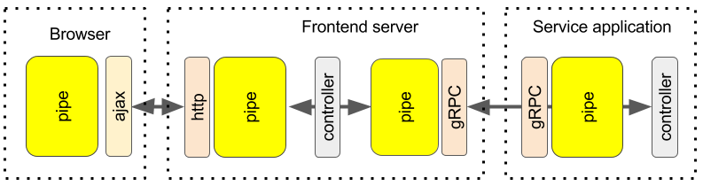

# Transport With Context Provider

In this chapter we are going to review what it takes to connect pipes using transport and implement a basic http transport as an example with context serializer/deserializer component.



As you can see on this diagram depicting an average application pipeline, the transports act as connectors between separate instances of the distributed application.

Connecting pipes together via transports is not enough. The platform must provide a context propagation across different instances that would make distributed transaction work as if it was executed on one VM.

Transport connector is the best place where a context serialization/deserialization can be done for the transport is the only component that has knowledge about the communication protocol.

The transports can be abstracted from the platform artifacts while context component is the one defined by the platform and implements serialization/de-serialization rules for the context properties.

The possible context carriers:

- Cookies for web applications
- Headers for service RESTful applications and clients
- Metadata for gRPC applications and clients

Now we are going to implement an http transport and context for a RESTful service invocation. You can use this example as a base to implement a context for any other transport.

The http context component would serialize context data into http headers for the request object and read/de-serialize context data from the response headers.

The context component should be injected into transport via configuration.

### Transport configuration

```json
"http-transport": {
    "transport": true,
    "module": "trooba-http-transport",
    "config": {
      "context": "my-context-provider"
    }
}
```

### Transport implementation

```js
module.exports = function transport(pipe, config) {
    if (config && config.context &&
    pipe.store && !pipe.store.contextProvider) {
        pipe.store.contextProvider = typeof config.context === 'string' ?
            require(config.context) :
            config.context;
    }

    pipe.on('request', request => {
        if (context) {
            // serialize context
            request.headers = request.headers || {};
            pipe.store.contextProvider.serialize(pipe.context, request);
        }
        // continue http request invocation here
        Wreck.request(request.method,
        config.url, request, (err, response) => {
            if (err) {
                return pipe.throw(err);
            }
            // read response
            Wreck.read(response, (err, body) => {
                if (err) {
                    return pipe.throw(err);
                }
                response.body = body;
                // de-serialize context
                if (context) {
                    pipe.store.contextProvider.deserialize(response, pipe.context);
                }
                pipe.respond(response);
            });
        });
    });
};
```

### Context component implementation

```js
module.exports = {
    serialize(context, requestContext) {
        const target = Object.keys(context).reduce((memo, name) => {
            if (name.charAt(0) !== '$') {
                memo[name] = context[name];
            }
            return memo;
        }, {});

        requestContext.headers['X-COMP-CONTEXT'] = JSON.stringify(target);
    },

    deserialize(responseContext, context) {
        Object.assign(context, JSON.parse(responseContext.headers['X-COMP-CONTEXT']);
    }
};
```
