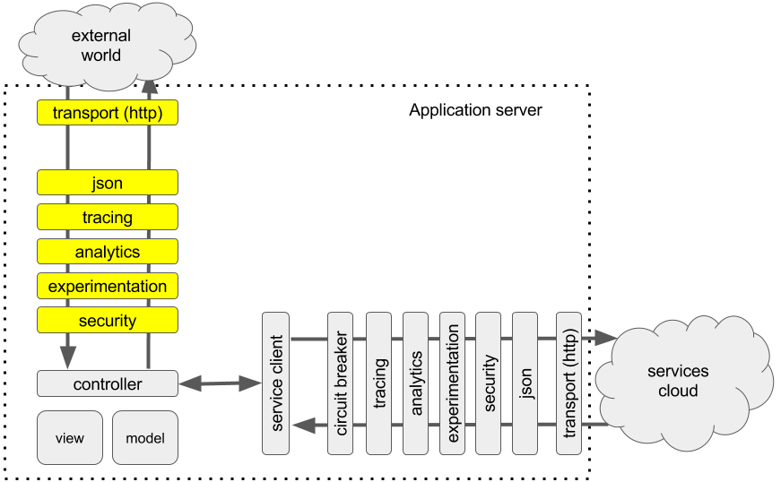
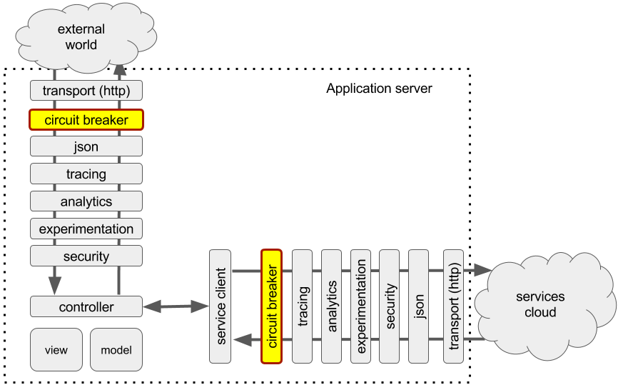
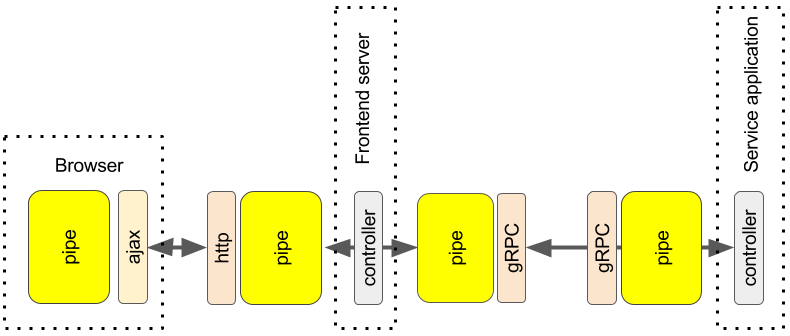

# Pipelines Everywhere!

Our pipeline framework turned out to be very generic, so it may be not a crazy idea now to look back and apply our pipeline on the incoming traffic instead of express middleware pipeline.

Now our application seems like a chain of pipelines connected to each other through transports or controllers that are merely a different type of pipe, a traffic splitter and transformer that directs traffic to other pipelines based on route or other runtime properties and collector.

When it is generic, it is easy to apply uniform approach designing them and spot any gaps or missing parts.

For example, note that the service invocation pipeline has a circuit breaker while the incoming traffic pipeline does not. Why?

According to Wiki: “Circuit breaker is used to detect failures and encapsulates logic of preventing a failure to reoccur constantly (during maintenance, temporary external system failure or unexpected system difficulties)”

Circuit Breaker pattern was popularized by Netlfix through Hystrix component in java world and now is expanding to other programing languages.

Why not use it on incoming traffic? What are the potential use-cases?

The most obvious use-case is to increase the resiliency of the system by monitoring server instance state and notifying the clients right away about any problems before it starts affecting the system and in case when the system is too busy (CPU >95%), we can offload incoming traffic to other clusters/datacenters or let the clients know by sending 503 response.

It is always good to prevent overwhelming of the system by too much traffic sooner than later. There are various causes for this situation. It can be due to DDoS attack or when traffic is diverted from other data center without regard to the capacity of the target data center and things like that.

The updated diagram now looks like this:

If we analyze it now, we can see that the circuit breaker in the service invocation pipeline acts on assumption that the downstream service is in a bad state or under pressure and short circuiting we give some time for the service to recover, this is still an assumption.

The circuit breaker on the incoming pipeline entirely belongs to the application and is aware of the application state. This allows the circuit breaker to generate more valid responses when the system gets under pressure and needs to shed some traffic. For example, if the circuit breaker was not there and the system got too busy, that would slow down handling the incoming requests and some of the calls would inevitably timeout out. This is not optimal outcome as the client application would waste their time waiting for response and get unknown state for the resources that were accessed. With the circuit breaker the application can quickly respond with 503 status code giving a clear state to the client that non of the resources have been affected and the client can safely re-try the service call.

For more details on how to implement this you might want to check out [this blog post](https://codeburst.io/building-resilient-platform-part-1-51b852588fb3) and [this](https://codeburst.io/building-resilient-platform-part-2-509c9550617d)

Now if we fly really high and look at our pipelines, we could see something like this:

As you may notice, the transports connect pipes of separate instances of our distributed application while the controllers connects pipes within a single application instance.

This also can give us some ideas on how to proceed further designing our pipeline based systems. If a transport is replaceable and the controller is a kind of the transport, then we can try to replace applications as any other transports. The transports and controllers are the only "handlers" that have specifics of the protocol/application. The rest are generic and can be moved outside of the application. 

